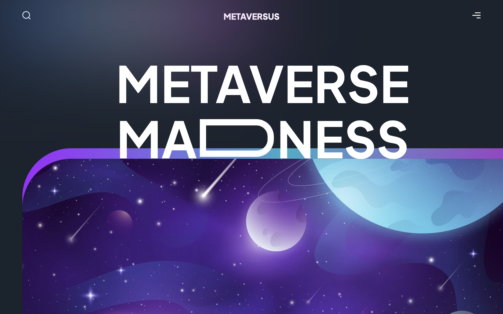
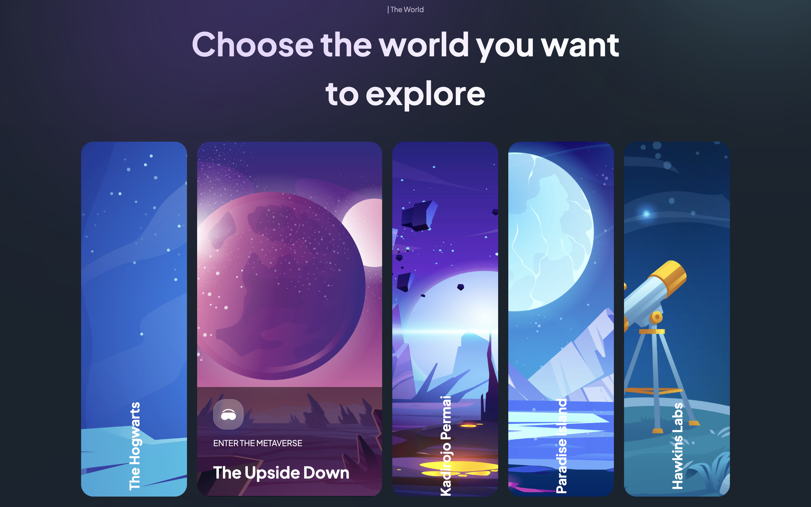

# Metaversus: A Futuristic Virtual Landing Page

## Table of contents

- [Introduction](#introduction)
- [Demo](#demo)
- [Technology](#technology)
- [Features](#features)
- [Deployment](#deployment)
- [Run](#run)

## Introduction

Welcome to Metaversus, a visionary landing page website that provides a tantalizing glimpse into the potential future of the Metaverse phenomenon. This modern and captivating website design offers a conceptual exploration into the world of "Metaversus," where reality blends seamlessly with the virtual, sparking curiosity and imagination.

## Demo

## Technology

Metaversus is brought to life using a sophisticated blend of cutting-edge technologies:

- React: Powering the dynamic and interactive elements of the website.
- Next.js 13: Leveraging the latest advancements in Next.js for enhanced performance and development experience.
- Tailwind.css: Crafting sleek and modern user interface designs with ease.
- Framer Motion: Adding fluid animations and transitions that enhance user engagement.

## Features

- Innovative Design: Metaversus showcases a modern and captivating design that reflects the futuristic concept of the Metaverse. Its aesthetics provide users with a sneak peek into a world where reality and the virtual blend seamlessly.

- Metaverse Concept: Delve into the concept of the Metaverse, where you can explore virtual realms that mirror reality and experience them in a profoundly immersive way. Metaversus encapsulates the spirit of this new frontier.

- Explore Virtual Realms: Metaversus enables you to virtually navigate through concept-driven virtual realms, offering a tantalizing glimpse of the potential future of the Metaverse.

## Deployment

Metaversus has been deployed and can be experienced live at: http://metaversus.great-site.net/. Take a journey into the future of the Metaverse and explore the captivating design and concept firsthand.

## Run

To experience Metaversus locally, follow these steps:

1. Clone the repository to your local machine.
2. Install the required dependencies using npm or yarn: 'npm install' or 'yarn install'.
3. Run the development server using the command: 'npm run dev' or 'yarn dev'.
4. Access the website through your preferred web browser.